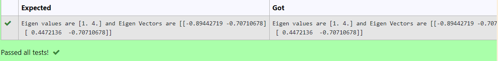

# EIGENVALUES-AND-EIGENVECTORS
## Aim:
To write a python program to find the Eigenvalues and Eigen Vectors
## Equipment’s required:
1. 	Hardware – PCs
2. 	Anaconda – Python 3.7 Installation / Moodle-Code Runner
## Algorithm: 
### Step 1:
 Using the np.linalg.eig(),  we get two results (first is eigenvalue and second is eigenvector) of the given matrix.

## Program:
```
 #Program to find the eigen values and eigen vectors.
#Developed by: Nithishkumar P
#RegisterNumber: 21005889
import numpy as n
a=n.array([[2,2],[1,3]])
b,c=n.linalg.eig(a)
print("Eigen values are {} and Eigen Vectors are {}".format(b,c))
```
## Output:

## Result:
Thus the Eigenvalue and Eigenvector is successfully solved using python program
